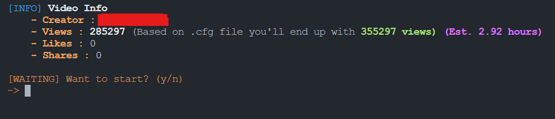
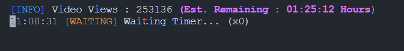

<p align="center"><a href="https://github.com/Sneezedip/Tiktok-Booster"></a></p>
<h1 align="center">Tiktok-Booster</h1>

TikTok View Booster is a Python-based tool designed to increase the view count of TikTok videos. This tool utilizes Tesseract OCR to recognize and bypass CAPTCHA challenges, ensuring a seamless and automated process for boosting video views.

<div align="center">

[](https://paypal.me/sneezedip)

[](https://discord.gg/nAa5PyxubF)

</div>

## Features

- **Automated Views:** Automatically increases the view count of specified TikTok videos.
- **CAPTCHA Bypass:** Utilizes Pillow and Tesseract OCR to accurately solve CAPTCHA challenges.
- **Easy to Use:** Simple configuration and setup for quick deployment.







## Usage

To run the program, follow these steps:

1. **Configure `config.cfg`:**
   - Open the `config.cfg` file in a text editor of your choice.
   - Adjust the settings as needed to suit your preferences and requirements.

2. **Open Command Prompt in `tiktokbooster` Folder:**
   - Navigate to the `tiktokbooster` folder.
   - Open a command prompt (cmd) in this folder. You can do this by:
     - Typing `cmd` in the address bar of the File Explorer and pressing Enter.
     - Right-clicking inside the folder, selecting "Open in Terminal" or "Open Command Window Here".

3. **Run the Program:**
   - In the command prompt, execute the following command:
     ```sh
     python3 main.py
     ```
   - (or you can use Visual Studio Code)

4. **Wait:**
   - Allow the program to run and complete its tasks. This may take some time depending on the configurations and operations being performed.

# Version 2.9.1
   -  Contribution by rowan0881:
      New Language! (Dutch)
   -  Added:
      More Languages! (French, Spanish, German, Italian, Russian, Arabic, Japanese )
   Info : 
      Not every phrase is translated, doing it in the future...

      
      
### for more info check [*versionslog.md*](https://github.com/Sneezedip/Tiktok-Booster/blob/main/versionslog.MD)

**Please note: This project is not intended for commercial use. It is provided for educational and personal use only.**
